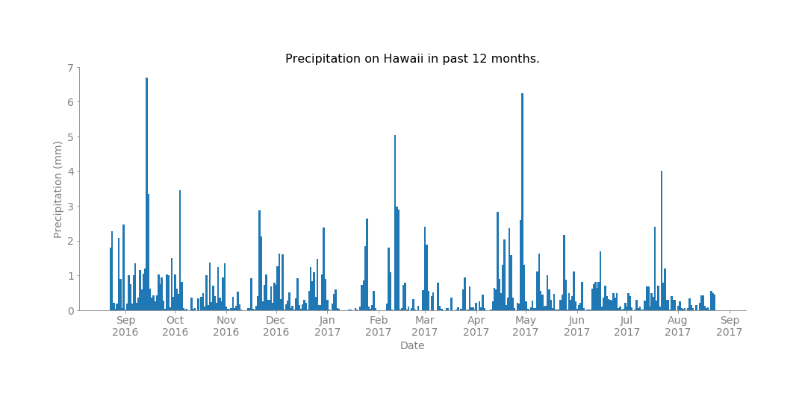

# SQLAlchemy-challenge
This is a mock project developed to perform sql queries with `SQLAlchemy` and develop a basic app using `Flask` using `Python`.
<p align="center">
  
</p>

## Background
There are essentially 3 main objectives:-
1. Use `Python` and `SQLAlchemy` to perform basic climate analysis and data mining of an `SQLite` database.
2. Visualize the queried results and extract essential insights.
3. Design a `Flask` API based on the queries utilizing `SQLAlchemy`.

## Prerequisites
You should have the following python packages installed in your Python environment to run the included jupyter notebooks:-
```
os
sqlalchemy
pandas
numpy
scipy
matplotlib
datetime
dateutil (source: https://dateutil.readthedocs.io/en/stable/)
```
Some custom functions are built for recursive usage in the jupyter notebook and are included in ```my_functions.py```.

## File Layout
1. Preliminary analysis and data visualizations are performed in `hawaii_db_analysis.ipynb'.
2. The `Flask` API is developed in `app.py`.
3. Custom functions to improve visualizations and manipulate `datetime` objects are included in `my_functions.py`.
4. The data visualizations are saved as `.png` format and are included in _Outputs/Images_.

## Future Goals
1. Implementing Error Handeling in the flask API to catch start or end dates which may not exist in the database.
2. Perform additional Bonus analyses.
